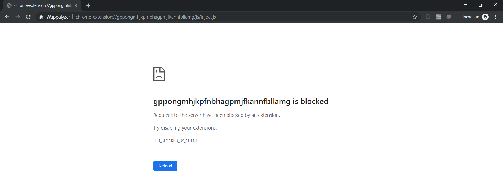

# Research on Chrome's Incognito Mode

### Extension Resources Block Attack (res-block)

This attack can be used to detect if victim is using Incognito mode in latest version of Chrome (77.0.3865.90) or not. Discovered by @0x48piraj

#### Anatomy of res-block attack

Sometimes developers share package resources of their Chrome extension, for example, images, HTML, CSS, or JavaScript and make them available to web pages. They do this via utilizing `web_accessible_resources`

As per Chrome's documentation,

An array of strings specifying the paths of packaged resources that are expected to be usable in the context of a web page. These paths are relative to the package root, and may contain wildcards. For example, an extension that injects a content script with the intention of building up some custom interface for example.com would allow any resources that interface requires (images, icons, stylesheets, scripts, etc.) as follows:

```
{
  ...
  "web_accessible_resources": [
    "images/*.png",
    "style/double-rainbow.css",
    "script/double-rainbow.js",
    "script/main.js",
    "templates/*"
  ],
  ...
}
```


More info : https://developer.chrome.com/extensions/manifest/web_accessible_resources

These resources then become available in a webpage via the URL `chrome-extension://[PACKAGE ID]/[PATH]`, which can be generated with the `extension.getURL` method. Allowlisted resources are served with appropriate CORS headers, so they're available via mechanisms like XHR.

The documentation goes on and states that some work has already been done previously focusing on different domain utilizing web accessible resources as the blob states:

> **Prior to manifest version 2 all resources within an extension could be accessed from any page on the web.** This allowed a malicious website to fingerprint the extensions that a user has installed or exploit vulnerabilities (for example XSS bugs) within installed extensions. Limiting availability to only resources which are explicitly intended to be web accessible serves to both minimize the available attack surface and protect the privacy of users.

During my research, what I found interesting was that, these paths (`chrome-extension://[PACKAGE ID]/[PATH]`) were not available to Incognito mode, maybe it is because Chrome by default blocks extensions in Incognito mode because it can't guarantee that the extensions aren't tracking one's data.

This actually opened a loophole. What if one scans for popular extensions which had "web_accessible_resources" parameter in their Manifest and then tries to access those one by one ?

Let's test this with **Wappalyzer chrome-extension** as I know it has "web_accessible_resources" in it's Manifest by looking at it's [source](https://github.com/AliasIO/Wappalyzer/tree/master/src/drivers/webextension)


```
--SNIP--
  ],
  "web_accessible_resources": [
    "js/inject.js"
  ],
--SNIP--
```

The path seems to be `js/inject.js`, now to find the [PACKAGE ID], we can just visit `chrome://extensions`, switch to **Developer mode**, see extensive details about extensions.


**NOTE:** As the [PACKAGE ID] is contant through-out, it is a **reliable attack vector**. 

Final Payload : `chrome-extension://gppongmhjkpfnbhagpmjfkannfbllamg/js/inject.js`


As expected, now, let's test this over Incognito mode,



Aha! It shows an error with code `ERR_BLOCKED_BY_CLIENT` or say, `Failed to load resource: net::ERR_BLOCKED_BY_CLIENT`